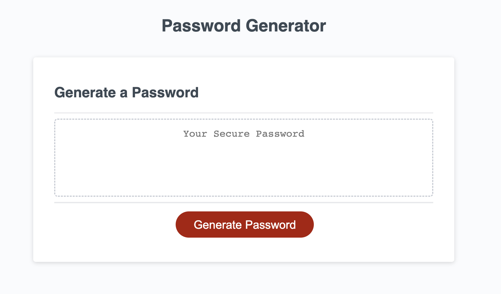

# Password Generator Starter Code

## Description

This webpage uses JavaScript to allow the end user to randomly generate a password. The starter code included the HTML and CSS elements, but the site was not properly following the acceptance criteria, and the JavaScript code required significant changes. I've summarized below how this website is designed to operate: 

* When the user clicks the button to generate a password, then they are presented with a series of prompts for password criteria, where they select which criteria to include in the password.  
    * Length (8 to 128 characters)
    * Character types (lowercase,uppercase,numeric, and special characters) - It is required to select at least 1 of the 4 types
* WHEN all prompts are answered, THEN a password is generated that matches the selected criteria, and is written to the page for consumption

## Usage

The Github repository can be found here: https://github.com/dscornaienchi/javascript-password-generator 

The website can be found at the URL here: https://dscornaienchi.github.io/javascript-password-generator 

The website should look like the screenshot shown below:

## Credits

Initial starter code provided by Xandromus, the repository can be found here: https://github.com/coding-boot-camp/friendly-parakeet

Tutorials and instruction provided by the University of Texas at Austin Full Stack Web Developement Program and it's affiliated professors and TA's. 